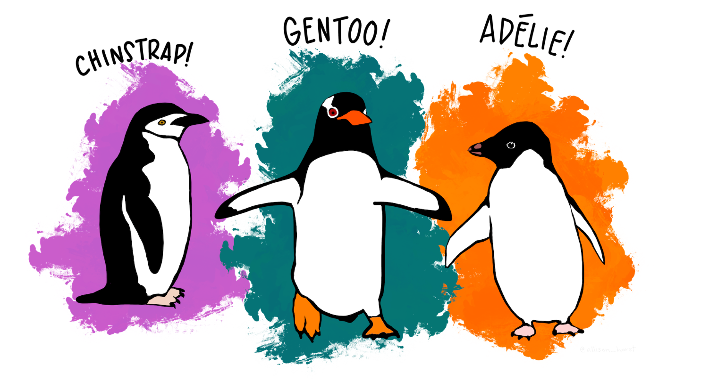

```{r setup, warning = FALSE, include=FALSE}
knitr::opts_chunk$set(echo = TRUE)
```

```{r message=FALSE, warning = FALSE}
library(dplyr)
library(ggplot2)
```

# Énoncé

Pour ce TP nous allons utiliser un jeu de donnees contient des mesures morphologiques pour trois especes de pingouins observees sur trois iles de l'archipel Palmer, en Antarctique.

Ce jeu de donnees comprend 6 variables et 333 individus. Les trois especes de pingouins observees sont:

  * Adelie
  * Gentoo
  * Chinstrap



Telecharger les donnees penguins et explorer-les a l'aide de la visualisation  

# Exploration des données

Je télécharge les données et je les importe
```{r}
penguins <- read.csv("data/data_penguins.csv", sep = ",")
```

J'affiche les 5 premières lignes du jeu de données pour me donner une idée des données
```{r}
head(penguins)
```

J'affiche les informations sur le jeu de données
```{r}
summary(penguins)
```

J'affiche le nombre de lignes et de colonnes du jeu de données
```{r}
dim(penguins)
```

# Visualisation des données

## Espèce
Voici un affichage du nombre d'individus pour chaque espèce de pingouin, dans un diagramme en camembert.
```{r fig.align="center",fig.width = 15, fig.height = 10}
graphbyspecies <- ggplot(data = penguins, aes(y = species, fill = species)) + geom_bar(width = 1) + coord_polar("y", start = 0) + labs(title = "Nombre d'individus pour chaque espèce de pingouin", y = "Nombre d'individus") + theme(legend.position = "none")
graphbyspecies
```

## Sexe/espèce
Voici un affichage du nombre de mâles et de femelles pour chaque espèce de pingouin, dans un graphique en barre.
```{r fig.align="center",fig.width = 15, fig.height = 10}
graphbysex <- ggplot(data = penguins, aes(x = sex)) + geom_bar(aes(fill = species)) + labs(title = "Nombre de mâles et de femelles pour chaque espèce de pingouin", x = "Sexe", y = "Nombre de pingouins")
graphbysex
```

## Longueur du bec/masse corporelle/espèce
Voici un affichage de la longueur du bec en fonction de la masse corporelle pour chaque espèce de pingouin, dans un graphique en nuage de points, coloré selon l'espèce de l'individu concerné.
```{r fig.align="center",fig.width = 15, fig.height = 10}
graphbeakbybodymass <- ggplot(data = penguins, aes(x = body_mass_g, y = bill_length_mm, color = species)) + geom_point() + labs(title = "Longueur du bec en fonction de la masse corporelle pour chaque espèce de pingouin", x = "Masse corporelle (g)", y = "Longueur du bec (mm)")
graphbeakbybodymass
```

## Longueur des palmes/masse corporelle/espèce
Voici un affichage de la longueur des palmes en fonction de la masse corporelle pour chaque espèce de pingouin, dans un graphique en nuage de points, coloré selon l'espèce de l'individu concerné.
```{r fig.align="center",fig.width = 15, fig.height = 10}
graphflipbybodymass <- ggplot(data = penguins, aes(x = body_mass_g, y = flipper_length_mm, color = species)) + geom_point() + labs(title = "Longueur des palmes en fonction de la masse corporelle pour chaque espèce de pingouin", x = "Masse corporelle (g)", y = "Longueur des palmes (mm)")
graphflipbybodymass
```

# Conclusion

Voici donc mon dernier graphique, qui contient les 4 graphiques précédents, pour avoir une vision d'ensemble des données. Ainsi que de comparer les 3 espèces entre elles.

## Longueur du bec/longueur des palmes/masse corporelle/espèce
Voici un affichage de la longueur du bec en fonction de la longueur des palmes pour chaque espèce de pingouin, dans un graphique en nuage de points, coloré selon l'espèce de l'individu concerné et dont la taille des points dépends de la masse corporelle.
```{r fig.align="center",fig.width = 15, fig.height = 10}
graphbeakbyflipper <- ggplot(data = penguins, aes(x = flipper_length_mm, y = bill_length_mm, color = species, size = body_mass_g)) + geom_point() + labs(title = "Longueur du bec en fonction de la longueur des palmes pour chaque espèce de pingouin", x = "Longueur des palmes (mm)", y = "Longueur du bec (mm)")
graphbeakbyflipper
```

## Résumé des données
Les pingouins de l'espèce "Adelie" sont en général les plus léger, avec de petites palmes et un petit bec.

Les pingouins de l'espèce "Gentoo" sont en général les plus lourd, avec les plus grandes palmes et un grand bec aussi long que les "Chinstrap".

Les pingouins de l'espèce "Chinstrap" sont moyennement lourd, avec des palmes de taille moyenne et un bec aussi long que les "Gentoo".